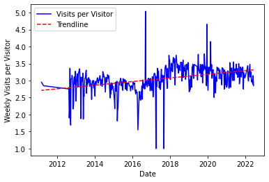

# Guido Fawkes Analysis

Scraping [Guido Fawkes]https://order-order.com/about/)'s Saturday Seven Up pages to derive some insights into the _most widely read politics source in Westminster_.

## Who?

Guido Fawkes, the _most widely read politics source in Westminster_, is a politics website that frequently breaks stories that go on to dominate newspaper pages. It's written in the character of Guido (the only man to enter parliament with honest intentions) by an editorial team who see themselves, unashamedly, as campaigning journalists. It's the bane of politicians across the political spectrum, although it must be said more so the Labour party in recent years.

All of the 'Saturday 7-up' articles can be seen from viewing the following [tag](https://order-order.com/tag/saturday-seven-up/) on their website. These (mostly) weekly posts demonstrate a shocking level of transparency about the number of visitors, visits and page views the site recieves every week. With this information scraped from the site, we can draw some interesting insights into the growth of Guido Fawkes.

## Growth of Guido Fawkes

This section looks at the growth of the Guido Fawkes ~~blog~~ website over the past 10 years of data available on the website.

### Visitors

By looking at the change in visitor numbers, we can see how the public knowledge about Guido Fawkes (myself included) has increased.

Significantly more visited in the mid-2010s, the site has seen stagnation and then decline in the past 2 years. Despite this, over the 10 year period that I have been able to scrape data for we have an average weekly increase in viewership of 32835 (owing to previously high levels of visitorship).

**Make cumulative visitorship graph**

### Visits

The linegraph of visits looks remarkably similar to the visitors graph, although on the whole the y-axis of Weekly Visits is a lot larger.

As mentioned earlier, it demonstrates similar features to the Visitors line graph, included sporatic periods of large weekly increase and a tailing off in site performance in the past two years. This tailing off appears more dramatic than that of the Visitors line graph - although that may just be a function of the relationship between visitors and visits. The average weekly increase in visits is 75583 (owing to previously high levels of visiting).

Now, we will take a look at the relationship between visitors and visits.

This graph actually alludes to something quite positive about the state of Guido Fawkes, the number of visits that a visitor makes in a week is firstly more than one (i.e. multiple advertising impressions) but secondly increasing. People on average are returning an increasing amount of times throughout the week the read the posts. The average weekly increase in visits per visitor is 0.235 (3 s.f.) pages, although this figure masks some occasional sluggish peformance.

**Make cumulative visitorship graph**

### Page Views

## Analysis about Saturday Seven Posts

This section looks at the ~~potentially~~ less consequential changes in the content and nature of Saturday Seven Posts.

### Title

### Post Time

### Number of Articles Featured

###

## File List

- `analysis.ipynb` - File for all the analysis we need to perform, using our data collected
- `article_details.py` - Get details to all articles and save it as a .pkl file
- `article_detail_functions.py` - Get all the links to articles and content from an article link.
