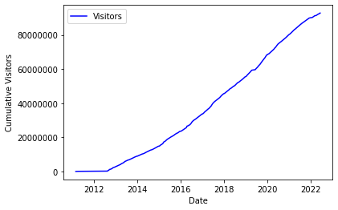
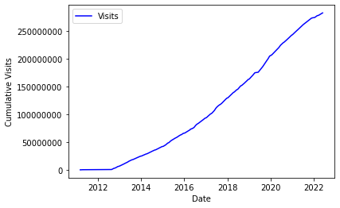
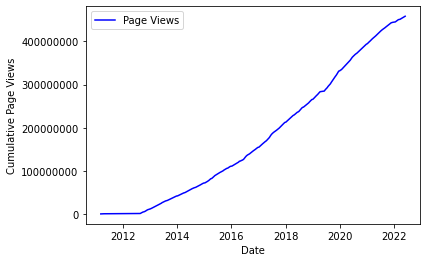
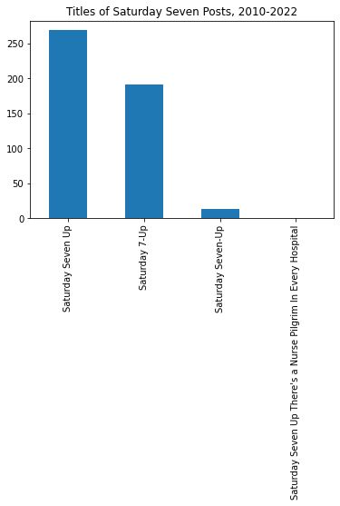
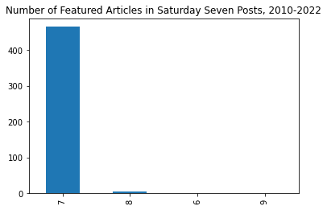
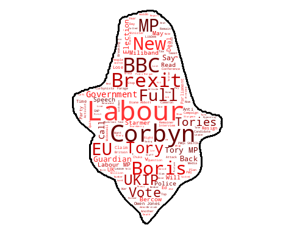

# Guido Fawkes Analysis

Scraping [Guido Fawkes](https://order-order.com/about/)'s Saturday Seven Up pages to derive some insights into the _most widely read politics source in Westminster_.

## Who?

Guido Fawkes, the _most widely read politics source in Westminster_, is a politics website that frequently breaks stories that go on to dominate newspaper pages. It's written in the character of Guido (the only man to enter parliament with honest intentions) by an editorial team who see themselves, unashamedly, as campaigning journalists. It's the bane of politicians across the political spectrum, although it must be said more so the Labour party in recent years.

All of the 'Saturday 7-up' articles can be seen from viewing the following [tag](https://order-order.com/tag/saturday-seven-up/) on their website. These (mostly) weekly posts demonstrate a shocking level of transparency about the number of visitors, visits and page views the site recieves every week. With this information scraped from the site, we can draw some interesting insights into the growth of Guido Fawkes.

## Growth of Guido Fawkes

This section looks at the growth of the Guido Fawkes ~~blog~~ website over the past 10 years of publicly available data scraped from the website.

### Visitors

By looking at the change in visitor numbers, we can see how the public knowledge about Guido Fawkes (myself included) has increased.

Significantly more visited in the mid-2010s, the site has seen stagnation and then decline in the past 2 years. Despite this, over the 10 year period that I have been able to scrape data for we have an average weekly change in viewership of 184 viewers (owing to previously high levels of visitorship, but a recent slump).

The above graph is a cumulative graph of the visitorship that the Guido Fawkes site has seen across the over 10 years of data that we have gathered here. However, as the site has been in operation since 2004, we are missing nearly half of the data required for a complete analysis and so the true number of total visitors could be even higher. However I would suspect that our current total of over 92 million is an overestimate, as this statistic doesn't (and can't) track repeat visitors across weeks.

### Visits

The linegraph of visits looks remarkably similar to the visitors graph, although on the whole the y-axis of Weekly Visits is a lot larger.

As mentioned earlier, it demonstrates similar features to the Visitors line graph, included sporatic periods of large weekly increase and a tailing off in site performance in the past two years. This tailing off appears more dramatic than that of the Visitors line graph - although that may just be a function of the relationship between visitors and visits. The average weekly change in visits is 510 visits (owing to previously high levels of visiting, but a recent slump).

Now, we will take a look at the relationship between visitors and visits.

This graph actually alludes to something quite positive about the state of Guido Fawkes, the number of visits that a visitor makes in a week is firstly more than one (i.e. multiple advertising impressions) but secondly increasing. People on average are returning an increasing amount of times throughout the week the read the posts. The average weekly change in visits per visitor is -0.000219 (3 s.f.) pages, although this figure masks consistent sluggish peformance.

In this graph we see the historically impressive growth of visits to the Guido Fawkes site, although since 2020 the cumulative graph slope has been slowing, owing to the decrease in visits that I've addressed above. This statistic is impressive however, over the near 12 years of data I have gathered, some 282 million visits to the site have been recorded.

### Page Views

The linegraph of page views, the amount of views that all pages of the Guido Fawkes website recieved in the past week, is a rather telling one.

Once again it shows similar features to graphs above, it has the decline in the past two years, the average weekly change in Page Views is 791, and sporadic occasions of dramatic increase. If we isolate the range to the final two years of Page Views on the Guido Fawkes site.

We can see that page views on the site have collapsed massively in the past two years. Consistently trending down, the page views have near halved in the past two years, with the trendline showing a significant slope. The weekly average change in page views was -6357, clearly demarking this declining viewership. When we turn to look at Page views per visit:

This particular graph isn't stand-out, we see overall a decrease in the amount of pages that a user clicks on per visit to the site. This is likely because the style of the Guido Fawkes site is that from the main page, you can see all the content of that page's stories without having to click. However nonetheless it's an interesting trend - but isolated to a single visit. When now expand our analysis to look the number of Page Views per Visitor:

When looking at the Page Views per Visitor line graph we see some more encouraging trends about the site, that the average number of pages that a visitor views each week are increasing. One can then assume from this that visitors are spending more time on the site in a week, leading to more advertising impressions and perhaps more revenue.

The final graph I present in this section alludes to many trends that I have discussed earlier; the decrease over the whole of the data and the slight uptick in the past two years. And this graph does present a monumental statistic, that pages on the Guido Fawkes website (read stories) have been viewed 458 million times!

## Analysis about Saturday Seven Posts

This section looks at the ~~potentially~~ less consequential changes in the content and nature of Saturday Seven Posts.

### Title

This graph shows how typically we have the blog post called one of two things, however on occasion a different title is used. To understand when the different titles are used, let's use a timeline to visualise this:

We can see clear trends in the naming of Saturday Seven Up posts, our data shows that historically the title name of "Saturday Seven Up" was popular before shifting to "Saturday 7-Up" - with brief usages of other titles.

### Number of Articles Featured

From this Bar Graph we can see how predominantly 7 featured articles are given in these posts, sometimes however more are shared.

The wordcloud above, represents the topics that Guido Fawkes talks about most frequently. These are the most common words from the title of the top 7 (or 6/8/9, see above) stories for every week. Clearly topics about Labour, the BBC and Brexit get a lot of airtime.

### Post Time

Finally we look at the time at which these Saturday Seven Posts are made, below we create a Histogram to show this:

## File List

- `analysis.ipynb` - File for all the analysis we need to perform, using our data collected
- `article_details.py` - Get details to all articles and save it as a _.pkl_ file
- `article_detail_functions.py` - Get all the links to articles and content from an individual article link.
